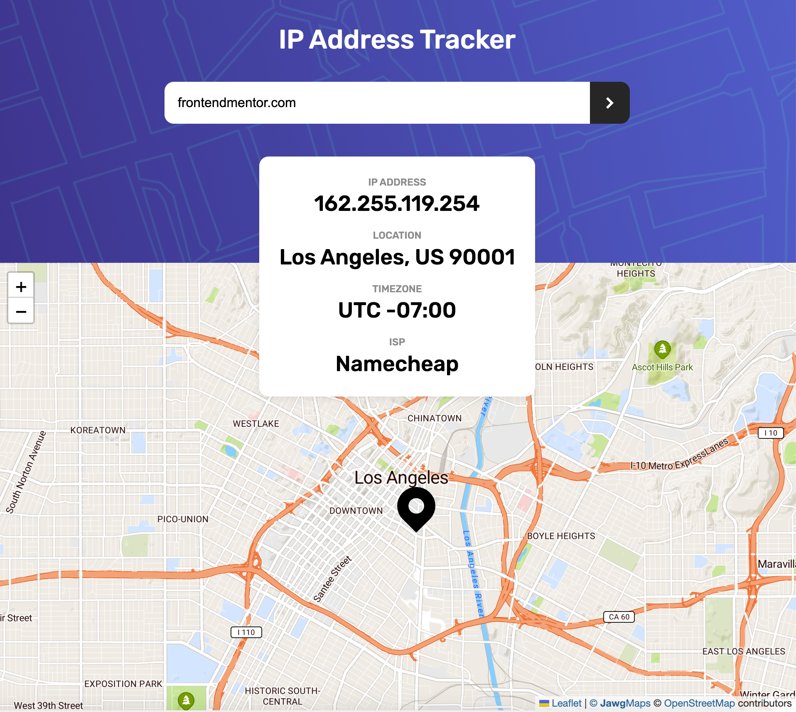

# Frontend Mentor - IP Address Tracker

### Description

This is a solution to the [IP address tracker challenge on Frontend Mentor](https://www.frontendmentor.io/challenges/ip-address-tracker-I8-0yYAH0).

### The challenge

Users should be able to:

- View the optimal layout for each page depending on their device's screen size.
- See their own IP address on the map on the initial page load. XX
- Search for any IP addresses or domains and see the key information and location.

### Built With

- Semantic HTML5.
- CSS.
- Vanilla Javascript.
- BEM.
- Leaflet Javascript library for the map [https://leafletjs.com/].
- IP Geolocation API [https://geo.ipify.org/].

### Links

- GitHub URL: [https://github.com/norrland90/ip-address-tracker]
- Live Site URL: [https://norrland90.github.io/ip-address-tracker]

### Contact

Created by [@norrland90](https://github.com/norrland90) - feel free to contact me!
